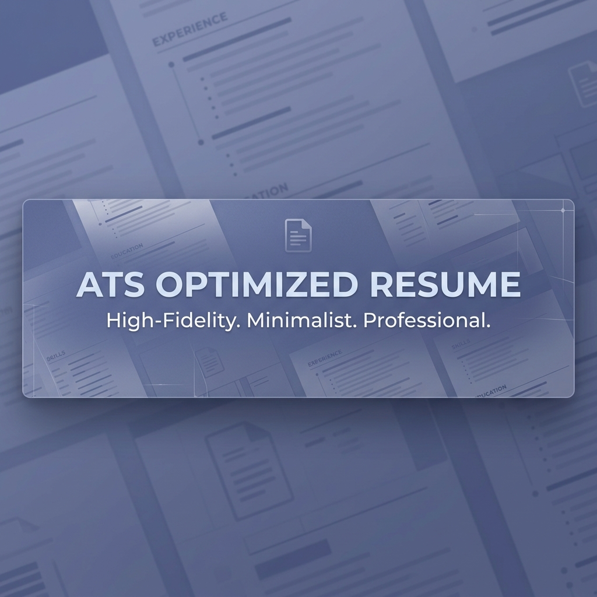
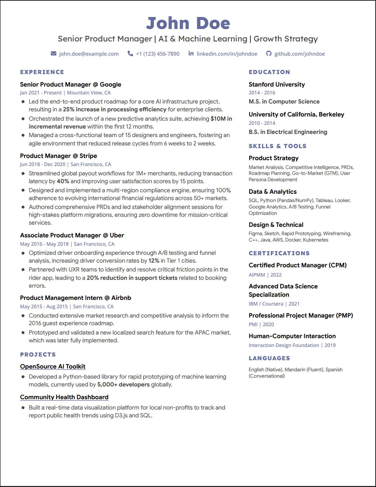

A high-fidelity, single-page resume template designed for modern **Product Managers**, **Designers**, and **Engineers**. This template is a 1:1 replica of a professional design system optimized for both human recruiters and Applicant Tracking Systems (ATS).



## ✨ Features

- **ATS-Optimized:** Ultra-tight margins (0.3" x 0.45"), high-contrast text, and a machine-readable 2-column grid layout.
- **Premium Native Typography:** Strictly adheres to professional font standards using locally installed fonts to ensure pixel-perfect rendering without web-font loading shifts:
  - **Google Sans:** Primary body text for high legibility.
  - **Lexend:** Bold, geometric headers for structural hierarchy.
  - **Open Sans:** Refined metadata (dates/locations).
- **Design Tokens:** Easy-to-customize CSS variables (`--primary`, `--text-main`, etc.).
- **Print-Ready:** Perfected for US Letter size with zero-bleed configuration.
- **SVG Social Icons:** Scale-perfect icons (Email, Phone, LinkedIn, GitHub).
- **Google XYZ Framework Ready:** Pre-styled for impact-driven achievement bullets (●).

## 🚀 Quick Start

### Prerequisites
To ensure the resume renders *exactly* as intended (and exactly as the example PDF), you **must** install the following font families on your local system before generating the PDF:
1. **Lexend** (Specifically *ExtraBold* and *Regular*)
2. **Google Sans** (Specifically *SemiBold* and *Regular*)
3. **Open Sans** (Specifically *Medium*)

*If you do not have these installed, your browser will fallback to system fonts, altering the intended design.*

### Usage Instructions
1.  **Clone/Download:** Download the `template.html` file.
2.  **Edit Content:** Open the file in any code editor (VS Code, Sublime, Notepad++) and replace the dummy placeholder content with your own.
3.  **Customize Style:** Adjust the CSS variables in the `:root` block to match your personal brand colors.
4.  **Save as PDF:** Open your edited `.html` file in a modern browser (Chrome or Edge recommended).
    - Press `Ctrl+P` (or `Cmd+P` on Mac).
    - Select **"Save as PDF"** as the destination.
    - Set Margins to **"Default"** or **"None"** (the CSS handles the margins natively).
    - **Crucial:** Ensure **"Headers and Footers"** are turned **OFF**.
    - Click Save.

### Headless PDF Generation (Automated)
For power users who want to automate the generation process without opening a browser window, you can use the headless print command.

**Using Microsoft Edge (Windows):**
```powershell
& "C:\Program Files (x86)\Microsoft\Edge\Application\msedge.exe" --headless --disable-gpu --no-pdf-header-footer --print-to-pdf="C:\path\to\your_resume.pdf" "C:\path\to\template.html"
```

**Using Google Chrome (Mac/Linux):**
```bash
google-chrome --headless --disable-gpu --no-pdf-header-footer --print-to-pdf="your_resume.pdf" template.html
```

## ⚠️ Disclaimer & Customization
**Font Licensing:** Please note that fonts like **Google Sans** are proprietary and may have usage restrictions depending on your application (commercial vs personal use). To avoid any legalities or if you simply wish to use open-source alternatives (like *Inter*, *Roboto*, or *Public Sans*), you can easily modify the template:
1. Under `<style>`, find `font-family: "Google Sans", sans-serif;` and replace `"Google Sans"` with your preferred font.
2. Modify the `:root` CSS variables (e.g., `--primary: #626B9C;`) to effortlessly change the entire color scheme to match your brand without altering the HTML structure.

## 🛠 Project Structure

```text
ATS-Resume-Template/
├── example/
│   ├── example.html    # Fully populated "John Doe" example source
│   ├── example.pdf     # The generated high-fidelity output (Preview)
│   └── example.png     # Visual preview of the example
├── images/
│   └── banner.png      # Social & README branding asset
├── template.html       # The blank base template ready for your data
├── README.md           # This guide
└── LICENSE             # MIT License
```

## 🎨 Style Guide Specifications
If you wish to replicate this design in Figma or other visual editors, adhere to these exact specifications:

### Typography & Colors
- **Person Name:** `Lexend` ExtraBold (800) | Size: `28pt` | Color: `#626B9C` | Centered
- **Person Tagline:** `Lexend` Regular (400) | Size: `13pt` | Color: `#434343` | Centered
- **Contact Ticker:** `Open Sans` Medium (500) | Size: `8.5pt` | Color: `#626B9C` | Centered
- **Section Headings:** `Lexend` ExtraBold (800) | Size: `9.5pt` | Color: `#626B9C` | Uppercase
- **Role & Company:** `Google Sans` SemiBold (600) | Size: `10pt` | Color: `#000000`
- **Timeline & Location:** `Open Sans` Medium (500) | Size: `8pt` | Color: `#626B9C`
- **Body Text:** `Google Sans` Regular (400) | Size: `9.5pt` | Color: `#434343`
- **Bullet Points:** Uses a custom `●` marker set at `0.65em` with specific absolute positioning.

### Figma Template Replication 
To build this exactly 1:1 in Figma for a community template:
1. **Frame Size:** Use a custom `US Letter` frame (`8.5 x 11` inches or `816 x 1056` px at 96 DPI).
2. **Auto Layout Grids:** Set up your master frame with margins: `0.3in` top/bottom (`~29px`) and `0.45in` left/right (`~43px`).
3. **Columns:** Use a horizontal Auto Layout for the main content with a `Gap` of `2rem` (`32px`). Set the Left Column to `Fill` (representing `2fr`) and Right Column to `Fill` (representing `1fr`).
4. **Spacing:** Ensure block items have a bottom margin/gap of `0.6rem` (`~10px`).
5. **Assets:** Extract the exact SVGs provided in the `template.html` source for perfect visual consistency.

## 📜 License

This project is licensed under the **MIT License**. You are free to use, modify, and distribute this template for any professional or personal use.

## 🌐 Why Web Tech? (HTML/CSS vs. LaTeX)

While LaTeX has been the traditional choice for high-fidelity documents, this template leverages modern web standards for several critical reasons:

1.  **Zero Barrier to Entry:** Unlike LaTeX, which requires a multi-gigabyte installation (MacTeX/MiKTeX) or a cloud subscription, this template works in any browser you already have installed.
2.  **Superior Layout Engine:** CSS Grid and Flexbox are fundamentally designed for UI and complex alignment. Replicating a 2-column grid with precise gaps is intuitive in CSS, whereas it often requires complex "boxes and glue" logic in LaTeX.
3.  **Real-Time Debugging:** You can use Browser DevTools (`F12`) to tweak margins, font weights, and colors in real-time. The "Code → Refresh" loop is significantly faster than the "Code → Compile → Wait" cycle of LaTeX.
4.  **Advanced Typography:** Browsers handle modern OpenType/TrueType features, sub-pixel rendering, and kerning with incredible performance, ensuring your resume looks sharp on every screen and in every print.
5.  **Clean ATS Parsing:** Modern browser rendering engines produce extremely clean PDF text layers. This ensures that Applicant Tracking Systems can parse your information without the encoding issues sometimes found in older LaTeX packages.

## 🙌 Inspiration & Credits

This design was inspired by the professional portfolio and design standards of **[Yitian Li](https://www.yitian-li.com/)**.
- **Role:** UX Designer @ Google | UC Berkeley MIMS
- **LinkedIn:** [yitian-tina-li](https://www.linkedin.com/in/yitian-tina-li/)

---

*Engineered for results. Designed for impact.*
